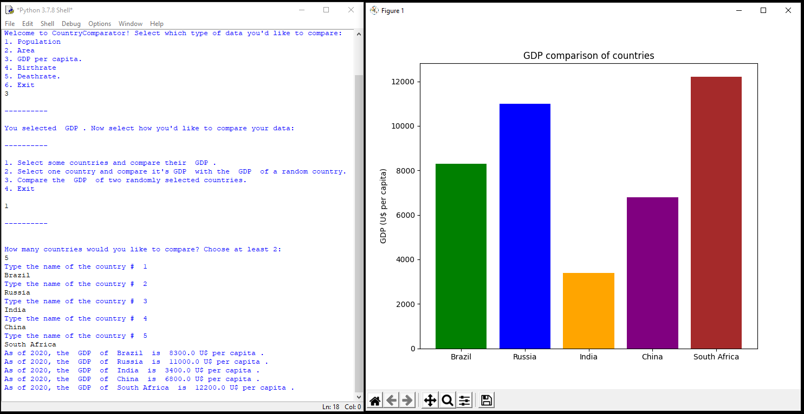

# CountryComparator

CountryComparator is a tool for helping you visualize countries' data and compare it to other countries! 

# Instructions:

It's pretty straightforward, just follow the guidelines of the menu after it starts.

You can select the type of data you wish to compare and then you have 3 options:

1. Select a few countries to compare their data;
2. Select one country and compare it's data with the data of a random country;
3. Compare the data of two randomly selected countries.

# How does it work:
The data comes from the [CIA Factbook](https://www.cia.gov/library/publications/the-world-factbook/index.html "CIA Factbook"). It is a great reference on the history, people and society, government, economy, energy, geography, communications, transportation, military, and transnational issues for 267 world entities.
I handpicked a few of these data for this project and I'm planning on adding many more! For now, we can compare:

* Population; 
* Area; 
* GDP per capita; 
* Birthrate per thousand population; 
* Deathrate per thousand population.

If you have a suggestion, let me know!

# Issues:

The CIA Factbook is a massive source of data. In order to parse through it and use it as a .csv file I had to use data that's very outdated (it's from 2006!). However, I'm already planning on updating the database with a few more topics to compare the data of the countries and as I add them, I'll start updating the previous data on the database.

# About the project:

I started this project to learn how to analyze large amounts of data and to plot graphs about such data on Python. I used the Pandas library to analyze the data and the Matplotlib to plot the data. Overall it was a great learning experience.  
